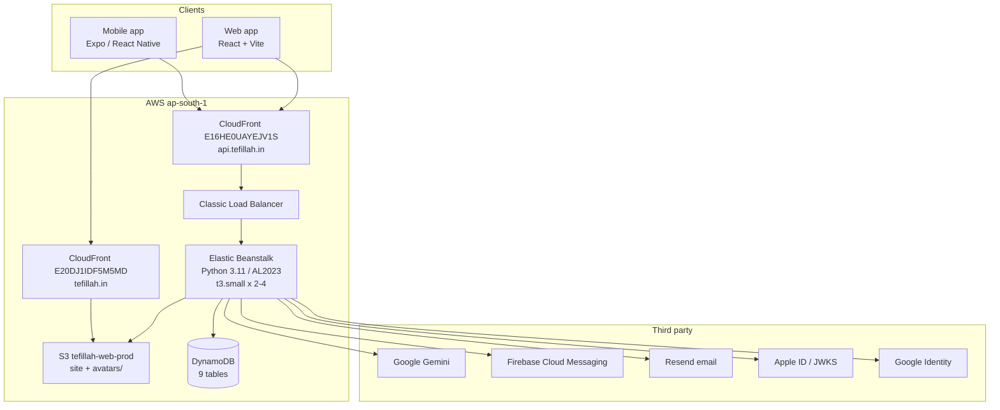

# TEFILLAH — Complete Technical Architecture, Security, Infrastructure, AI/LLM, Performance & Due-Diligence Report

| | |
|---|---|
| **Version** | 1.0 |
| **Date** | 2026-09-09 |
| **Repository commit audited** | `fe326e633a0ee51ed876f67d3e9c5ce32e8e43bc` (branch `main`, 2026-09-09 17:57 +0530) |
| **Environments examined** | Local repository (static analysis); live AWS `ap-south-1` (read-only API calls); live HTTPS endpoints |
| **Audit method** | Source inspection, configuration inspection, live read-only cloud queries, live endpoint probing |
| **Not examined** | Runtime memory/CPU profiles, load tests (none exist), Mongo Atlas console, Firebase console internals, Apple Developer portal internals |

## How to read this report

Every technical claim carries a confidence label. This is deliberate — the project was built with AI assistance and the team does not have complete knowledge of what was implemented, so the distinction between *proven* and *assumed* is the entire value of this document.

| Label | Meaning |
|---|---|
| `[VERIFIED]` | Directly confirmed from source, configuration, or a live read-only query. Evidence cited. |
| `[INFERRED]` | Strongly implied by multiple pieces of evidence, not directly stated anywhere. |
| `[UNVERIFIED]` | Plausible, but insufficient evidence. |
| `[UNKNOWN]` | Cannot be determined from available access. |
| `[RECOMMENDATION]` | A proposal. **Not currently implemented.** |
| `[SECURITY FINDING]` | Evidenced weakness. |
| `[SECURITY RISK]` | Potential concern requiring validation. |

**Where this report says UNKNOWN, that is a finding, not an omission.**

---

# 1. Executive Summary

Tefillah is a three-surface prayer platform: an Expo/React Native mobile app, a React web app (which also contains an admin console), and a single-file Python FastAPI backend on AWS Elastic Beanstalk, backed by DynamoDB, with Google Gemini as the LLM.

**The honest headline:** the backend is a **single 5,373-line Python file** serving **78 routes**, of which **62 enforce authentication server-side** and **16 are public**. Authentication and authorization are genuinely well implemented for a project of this origin — bcrypt hashing, pinned JWT algorithm, required claims, and real-time account-status revalidation on every request. The S3 and CloudFront posture is correct. Those are real strengths and they are evidenced below.

**The honest weaknesses**, all evidenced:

1. **Rate limiting does not work as intended in production.** It is stored in a per-process Python dict while the environment runs **2–4 load-balanced instances**, so every configured limit is multiplied by the instance count and resets on deploy.
2. **Application logs are not shipped anywhere.** `StreamLogs = false` on the Elastic Beanstalk environment. Logs live on instances that autoscaling destroys. **An incident more than a few days old, or on a replaced instance, cannot be reconstructed.**
3. **Every admin list, dashboard statistic and push fan-out performs a full DynamoDB table scan** into Python memory. The code documents this as a deliberate shortcut valid at ~1,000 items. It is the primary scaling cliff.
4. **The health check is a static 200.** It never touches the database, so the load balancer cannot detect a database outage.
5. **No CI/CD, no infrastructure-as-code, no automated tests on either frontend.** Deployment is a shell script run from a developer laptop.
6. **No verified capacity figure exists.** No load test has ever been run.

**Production status:** live and serving. `api.tefillah.in` and `tefillah.in` both return 200. The database was deliberately wiped to a clean slate on 2026-09-09 and currently contains 2 admin accounts and zero users.

---

# 2. What Is Tefillah?

`[VERIFIED]` A prayer-request platform with three participant types — **users** who submit prayer requests, **prayer partners** who are assigned those requests and pray over them, and **admins** who manage the platform.

Evidence: three separate identity tables (`tefillah_users`, `tefillah_partners`, `tefillah_admins` — `backend/migration/table_spec.py`), three distinct authentication dependencies (`get_current_user`, `get_current_partner`, `get_current_admin` — `backend/server.py:735, 797`), and an assignment model (`assigned_partner_id-assigned_at-index` GSI on the prayer requests table).

`[VERIFIED]` Prayer request content is **pastoral, health and family material** — inherently sensitive personal data. This is not incidental; it determines the risk weighting throughout this report.

---

# 3. Current System Architecture



`[VERIFIED]` every component shown. Evidence: `aws cloudfront list-distributions` (two distributions, aliases `tefillah.in` and `api.tefillah.in`); `aws elasticbeanstalk describe-environments` (platform `Python 3.11 running on 64bit Amazon Linux 2023/4.12.1`, tier WebServer); `aws elasticbeanstalk describe-configuration-settings` (`EnvironmentType=LoadBalanced`, `LoadBalancerType=classic`, `InstanceType=t3.small`, `MinSize=2`, `MaxSize=4`); `aws s3 ls` (buckets `tefillah-web-prod`, `elasticbeanstalk-ap-south-1-020262236044`); `backend/migration/table_spec.py` (9 DynamoDB tables).

`[SECURITY RISK]` The load balancer is a **Classic Load Balancer**, a legacy AWS product. It lacks native WAF integration and modern routing. Migrating to an ALB would enable AWS WAF in front of the API. Not currently present.

---

# 4. Complete Technology Stack

## 4.1 Backend

| Item | Value | Confidence | Evidence |
|---|---|---|---|
| Language | Python | `[VERIFIED]` | `backend/server.py` |
| Runtime | Python 3.11 | `[VERIFIED]` | EB PlatformArn |
| Framework | FastAPI `0.110.1` | `[VERIFIED]` | `backend/requirements.txt:1` |
| ASGI server | uvicorn `0.25.0` | `[VERIFIED]` | `requirements.txt:2`; `_eb_build/Procfile` |
| Process model | **single uvicorn process per instance** (no `--workers`) | `[VERIFIED]` | `Procfile`: `uvicorn server:app --host 0.0.0.0 --port ${PORT:-8000} --proxy-headers --forwarded-allow-ips=*` |
| Validation | Pydantic `>=2.6.4` | `[VERIFIED]` | `requirements.txt:5` |
| Password hashing | bcrypt `4.1.3` | `[VERIFIED]` | `requirements.txt:8`; `server.py:14,699-704` |
| JWT | PyJWT `>=2.10.1` | `[VERIFIED]` | `requirements.txt:7` |
| Crypto | cryptography `>=42.0` | `[VERIFIED]` | `requirements.txt:18` |
| AWS SDK | boto3 `>=1.34` | `[VERIFIED]` | `requirements.txt:17` |
| Push | firebase-admin `>=6.4.0` | `[VERIFIED]` | `requirements.txt:16`; `server.py:34` |
| HTTP client | httpx `>=0.27.0` | `[VERIFIED]` | `requirements.txt:15` |
| Mongo driver | pymongo `4.5.0`, motor `3.3.1` | `[VERIFIED]` — **present but the live backend is DynamoDB** | `requirements.txt:4,11` |

`[SECURITY RISK]` `python-jose>=3.3.0` and `passlib>=1.7.4` are listed in `requirements.txt:12,9` but the code uses **PyJWT** and **bcrypt directly** (`server.py:14`, `:699`). These appear to be unused legacy dependencies. Unused crypto libraries enlarge the supply-chain surface for no benefit. **Verification required:** confirm with a repo-wide import grep before removal.

## 4.2 Data layer

| Item | Value | Confidence | Evidence |
|---|---|---|---|
| **Live database** | **Amazon DynamoDB** | `[VERIFIED]` | EB env `DB_BACKEND=dynamo` (live query) |
| Alternate backend | MongoDB (Atlas) — code retained | `[VERIFIED]` | `backend/repo/__init__.py`; `backend/repo/mongo.py` (733 lines) |
| Swap mechanism | `DB_BACKEND` env var selects the repository set | `[VERIFIED]` | `repo/__init__.py:make_repos()` |
| Tables | 9 | `[VERIFIED]` | `migration/table_spec.py` |
| Object storage | S3 `tefillah-web-prod`, prefix `avatars/` | `[VERIFIED]` | `server.py:144`; live `aws s3 ls` |

**This is important and frequently misunderstood:** the migration from MongoDB to DynamoDB **has already occurred**. `DB_BACKEND=dynamo` is the live production value. MongoDB code remains in the repository as a rollback path.

## 4.3 Frontend

See §6 and §7 — produced by dedicated investigation and integrated below.

## 4.4 Third-party services

| Service | Purpose | Confidence | Evidence |
|---|---|---|---|
| Google Gemini | LLM | `[VERIFIED]` | EB env `LLM_PROVIDER=gemini`, `GEMINI_MODEL=gemini-2.5-flash` |
| OpenRouter | LLM fallback | `[VERIFIED]` | EB env `OPENROUTER_MODEL=deepseek/deepseek-chat-v3-0324` |
| Firebase (FCM) | Push notifications | `[VERIFIED]` | `server.py:34,887-899` |
| Firebase Auth | Social sign-in (web Apple) | `[VERIFIED]` | Firebase console: Email/Password, Google, Apple all Enabled |
| Resend | Transactional email | `[VERIFIED]` | `server.py:131`; `send_email()` posts to `api.resend.com` |
| Apple | Sign in with Apple (JWKS verification) | `[VERIFIED]` | `server.py:2015` `APPLE_JWKS_URL` |
| Google Identity | Google sign-in | `[VERIFIED]` | EB env `GOOGLE_WEB_CLIENT_ID` |
| MongoDB Atlas | Legacy / rollback only | `[VERIFIED]` | `MONGO_URL` still set on EB |

---

# 5. Repository Structure

`[VERIFIED]` via `git ls-files` at commit `fe326e6`.

| Directory | Tracked files | Contents |
|---|---|---|
| `frontend/` | 206 | Expo / React Native mobile app |
| `tefillah-web/` | 91 | React + Vite web app **and** admin console |
| `backend/` | 25 | FastAPI backend, repository layer, migration tooling, tests |
| root | 12 | Deploy script, docs, PDFs, **4 committed build zips** |

File types: 94 `.tsx`, 33 `.ts`, 24 `.py`, 18 `.json`, 8 `.bible`.

`[SECURITY RISK]` Four build artifacts (`tefillah-api-v3.zip` … `v6.zip`) are committed at the repository root. Build artifacts in version control can embed configuration from the moment they were produced. **Verification required:** inspect each zip for `.env` files or credentials before assuming they are inert.

**Key structural observation** `[VERIFIED]`: the entire backend is **one file of 5,373 lines** (`backend/server.py`), plus a 1,381-line DynamoDB adapter and a 733-line Mongo adapter. There is no controller/service/router package split. This is the single largest maintainability risk in the codebase — see §46.

---

# 8. API Architecture

`[VERIFIED]` by parsing every route decorator and its (possibly multi-line) function signature in `backend/server.py`.

| Metric | Count |
|---|---|
| Total routes | **78** |
| Enforcing auth via a `Depends(get_current_*)` | **62** |
| Public (no auth dependency) | **16** |

By method: 42 POST, 26 GET, 6 PUT, 4 DELETE.

By guard: `get_current_admin` ×25, `get_current_user` ×19, `get_current_partner` ×10, `get_current_super_admin` ×7, `get_current_user_optional` ×1.

## 8.1 The public attack surface (all 16)

| Method | Path | Notes |
|---|---|---|
| GET | `/health` | **Static 200 — touches nothing** |
| GET | `/` | Service banner |
| GET | `/verse/generate` | **LLM-backed, unauthenticated** |
| GET | `/cells` | Prayer cell list |
| GET | `/avatar/{owner_id}` | Serves avatar by owner id |
| POST | `/auth/register` | |
| POST | `/auth/login` | |
| POST | `/auth/verify-email` | |
| POST | `/auth/forgot-password` | |
| POST | `/auth/reset-password` | |
| POST | `/auth/social` | Google/Apple token exchange |
| POST | `/partner/register` | |
| POST | `/partner/login` | |
| POST | `/admin/create-first-admin` | One-time bootstrap |
| POST | `/admin/login` | |
| POST | `/prayer/guest-submit` | **Unauthenticated write path** |

`[SECURITY RISK]` `GET /verse/generate` and `POST /prayer/guest-submit` are unauthenticated and, respectively, invoke an LLM and create data. Both are cost- and abuse-relevant. Their protection depends entirely on rate limiting — which §33 shows does not function correctly across instances.

---

# 10. Authentication

## 10.1 Password handling — `[VERIFIED]`, and correct

```python
# backend/server.py:699-704
def hash_password(password: str) -> str:
    return bcrypt.hashpw(password.encode('utf-8'), bcrypt.gensalt()).decode('utf-8')

def verify_password(password: str, hashed: str) -> bool:
    return bcrypt.checkpw(password.encode('utf-8'), hashed.encode('utf-8'))
```

bcrypt with a per-password salt from `gensalt()`. This is the correct primitive. **Credit where due.**

## 10.2 Token model — `[VERIFIED]`

| Property | Value | Evidence |
|---|---|---|
| Type | JWT, symmetric | `server.py:708-718` |
| Algorithm | HS256, **pinned on decode** | `server.py:110`, `:724` |
| Lifetime | **24 hours** | `server.py:111` |
| Claims | `user_id, email, user_type, is_admin, exp, iat` | `server.py:710-717` |
| Required claims on decode | `exp`, `iat`, `user_id` | `server.py:725` |
| **Refresh tokens** | **NONE for user sessions** | grep: the only `refresh_token` references are Apple revocation (`server.py:2182`) |
| Revocation list | **NONE** | no denylist/blocklist exists |

`[VERIFIED]` Algorithm pinning plus required-claims enforcement blocks `alg:none` and HS/RS confusion. The code comments this as VULN-04. **This is done correctly.**

`[SECURITY FINDING] SEC-004 — no token revocation.` A stolen JWT is valid until `exp`, up to 24 hours. There is no denylist and no refresh/rotation. **Partial mitigation, and it is a real one** `[VERIFIED]`: every authenticated request re-reads the account from the database and re-checks status (`server.py:750-756`, `:806-810`). So a **disabled or deleted** account loses access immediately. What is *not* mitigated is a stolen token for an account that remains in good standing — that cannot be revoked short of rotating `JWT_SECRET` globally.

## 10.3 Social authentication — `[VERIFIED]`

Three token validators exist. Apple identity tokens are verified **directly against Apple's JWKS** (`server.py:2015` `APPLE_JWKS_URL`), not via Firebase — RS256, with issuer/audience/expiry enforcement.

`[SECURITY FINDING] SEC-001 — RESOLVED 2026-09-08, verified in place.` `POST /auth/social` previously matched an account on the token's **email string alone** while `email_verified` was computed by all three validators and **never read**. Because Firebase Email/Password is enabled on the project and the web API key is public by design, an ID token could be minted for any address and exchanged for a session on the matching account. A guard now rejects unverified and empty emails before any account lookup, using an allow-list comparison (the string `"false"` is truthy in Python, so a naive falsiness check was insufficient). Covered by `backend/tests/test_social_takeover.py` (12 checks), which was mutation-tested — disabling the guard makes the suite fail.

---

# 11. Authorization & Admin

## 11.1 Server-side enforcement — `[VERIFIED]`, and correct

```python
# backend/server.py, get_current_admin
token_data = decode_token(credentials.credentials)
if not token_data.get("is_admin"):
    raise HTTPException(status_code=403, detail="Admin access required")
admin = await repos.admins.get(token_data["user_id"])
if not admin:
    raise HTTPException(status_code=401, detail="Admin not found")
if not admin.get("is_active", True):
    raise HTTPException(status_code=403, detail="Admin account has been deactivated")
```

Three independent checks: the signed claim, existence in the **admins table**, and live active status. **Admin authorization is enforced server-side and does not depend on the frontend hiding anything.** This directly answers the standard due-diligence question and the answer is favourable.

## 11.2 Granular permissions — `[VERIFIED]`

A per-admin `permissions` list exists and is checked for destructive operations, e.g. `server.py:3661-3662`:

```python
perms = admin.get("permissions", [])
if "all" not in perms and "manage_users" not in perms:
    raise HTTPException(status_code=403, detail="Insufficient permissions to delete users")
```

`get_current_super_admin` additionally guards 7 routes.

`[SECURITY RISK]` `permissions` appears 36 times in `server.py`. Whether **every** destructive admin route is permission-checked, versus only role-checked, was **not exhaustively verified route-by-route** in this pass. **Verification required** — see §57 UNKNOWN-005.

---

# 12–13. Database Architecture & Data Model

`[VERIFIED]` Live backend is DynamoDB. Schema from `backend/migration/table_spec.py`:

| Table | Partition key | Sort key | Global secondary indexes |
|---|---|---|---|
| `tefillah_users` | `id` | — | `email-index`, `status-created_at-index` |
| `tefillah_partners` | `id` | — | `email-index`, `status-created_at-index` |
| `tefillah_admins` | `id` | — | `email-index` |
| `tefillah_prayer_requests` | `id` | — | `user_id-submitted_at-index`, `assigned_partner_id-assigned_at-index`, `status-submitted_at-index` |
| `tefillah_notifications` | `recipient_id` | `created_sort` | — |
| `tefillah_prayer_cells` | `id` | — | — |
| `tefillah_llm_logs` | `id` | — | `bucket-timestamp-index` |
| `tefillah_activity_logs` | `id` | — | `bucket-timestamp-index` |
| `tefillah_counters` | `counter_name` | — | — |

`[VERIFIED]` The access patterns are sensibly indexed: lookup by email, prayers by user, prayers by assigned partner, notifications by recipient with a sort key. **The data model is appropriate for DynamoDB** — this is genuine engineering quality, not accidental.

`[VERIFIED]` `tefillah_counters` is **not constructed by the repository factory** and nothing references `repos.counters`. It is a documented "scale-up path" that is not yet wired up. It is currently inert.

## 12.1 The scaling cliff — `[SECURITY RISK]` / performance finding

`[VERIFIED]` `backend/repo/dynamo.py:303` `_scan()` paginates the **entire table** into Python memory. The code documents this honestly:

> `ponytail: full Scan + in-Python filtering. The whole dataset is ~1000 items, so this is a few hundred KB and well under a second; the counters table in table_spec.py is the scale-up path…`

`[VERIFIED]` ~11 call sites, including `daily_counts` aggregations, `fcm_tokens()` (push fan-out), admin list endpoints, and CSV export. There are only **4 `.scan(` versus 3 `.query(`** calls in the adapter.

**Consequence:** every admin dashboard load, every daily statistic and every push fan-out reads the whole table. At the audited data volume (~1,000 items) this is genuinely fine. At 100,000 items each such call reads 100,000 items — latency, read-capacity cost and instance memory all grow linearly. **This is the primary architectural constraint on growth.**

## 12.2 Field-level protection — `[VERIFIED]`, and correct

Both adapters define a secrets denylist stripped from admin lists and exports:

```python
# repo/dynamo.py:66
_USER_SECRETS = ("password_hash", "verification_code", "apple_refresh_token")
```

Password hashes, verification codes and Apple refresh tokens cannot leak through the admin list or CSV export paths.

`[UNKNOWN]` **Encryption at rest for DynamoDB was not verified.** AWS encrypts DynamoDB by default with an AWS-owned key, but this was not confirmed for these specific tables, nor whether a CMK is used. **Verification required** (UNKNOWN-002).

`[UNKNOWN]` **DynamoDB point-in-time recovery status is unknown.** The deploy IAM user lacks `dynamodb:DescribeContinuousBackups` and `dynamodb:ListBackups` — both returned `AccessDeniedException`. **This means no one has confirmed that production data is recoverable.** See §43.

---

# 15. AWS / Cloud Infrastructure

`[VERIFIED]` via live read-only AWS API calls, `ap-south-1`.

| Service | Configuration | Evidence |
|---|---|---|
| Elastic Beanstalk | env `tefillah-api-prod-v2`, Python 3.11 / AL2023 platform 4.12.1, **LoadBalanced**, Classic LB | `describe-environments`, `describe-configuration-settings` |
| EC2 (via ASG) | `t3.small`, **Min 2 / Max 4** | `aws:autoscaling:asg`, `aws:ec2:instances` |
| DynamoDB | 9 tables | `table_spec.py` + live scans |
| S3 | `tefillah-web-prod` (site + `avatars/`), `elasticbeanstalk-ap-south-1-020262236044` (artifacts) | `aws s3 ls` |
| CloudFront | `E20DJ1IDF5M5MD` → `tefillah.in`; `E16HE0UAYEJV1S` → `api.tefillah.in`; both TLS min `TLSv1.2_2021` | `list-distributions` |
| CloudWatch Logs | **`StreamLogs = false`**, retention 7 days | `aws:elasticbeanstalk:cloudwatch:logs` |

## 15.1 S3 security — `[VERIFIED]`, and genuinely strong

| Control | Status |
|---|---|
| `BlockPublicAcls` / `IgnorePublicAcls` / `BlockPublicPolicy` / `RestrictPublicBuckets` | **all `true`** |
| Bucket policy | `s3:GetObject` allowed **only** to `cloudfront.amazonaws.com`, conditioned on `AWS:SourceArn` = the specific distribution |
| Versioning | **Enabled** (object-level rollback) |
| Default encryption | **AES256** (SSE-S3) |

This is a correct origin-access configuration. **Credit where due.**

## 15.2 Observability gap — `[SECURITY FINDING] SEC-002`

`[VERIFIED]` `StreamLogs = false`. Application logs are **not shipped to CloudWatch**. They exist only on instance local disk, with `DeleteOnTerminate=false` and 7-day retention configured for the (unused) log group.

The environment autoscales between 2 and 4 `t3.small` instances. **When an instance is replaced, its logs are gone.** Combined with the absence of metrics, tracing and alerting (§39), the practical answer to *"could you investigate a security incident after the fact?"* is **largely no**. This is the single highest-value operational fix available.

---

# 20. Security Architecture

## 20.1 Controls that exist — `[VERIFIED]`

| Control | Implementation | Evidence |
|---|---|---|
| TLS | CloudFront, min `TLSv1.2_2021` | live query |
| HSTS | `max-age=63072000; includeSubDomains; preload` | `server.py:1264` |
| `X-Content-Type-Options` | `nosniff` | `server.py:1260` |
| `X-Frame-Options` | `DENY` | `server.py:1261` |
| CSP | set by backend middleware | `server.py:1265` |
| CORS | explicit allowlist, credentials enabled, methods restricted | `server.py:1244-1248` |
| Password hashing | bcrypt + per-password salt | `server.py:699` |
| JWT algorithm pinning | `algorithms=[JWT_ALGORITHM]` + required claims | `server.py:722-726` |
| Live status revalidation | every request re-reads and re-checks the account | `server.py:750-756` |
| Input sanitization | `sanitize_input()` strips script/style/tags/`javascript:`/handlers/`data:`/entities | `server.py:~280`, 10 call sites |
| Upload limits | 3 MB cap, content-type allowlist | `server.py:142-143, 4744-4750` |
| Secrets denylist | stripped from admin lists/exports | `repo/dynamo.py:66`, `repo/mongo.py:42` |

## 20.2 `[SECURITY FINDING] SEC-003 — rate limiting is not globally enforced`

`[VERIFIED]`, and this is the most consequential live weakness.

```python
# server.py:211
rate_limit_storage: Dict[str, List[float]] = defaultdict(list)
```

An **in-process Python dictionary**. Meanwhile:
- `Procfile` runs **one uvicorn process** with no `--workers`
- the environment runs **2 instances now, up to 4** (`MinSize=2`, `MaxSize=4`; live health shows `Ok: 2`)

**Therefore every configured limit is effectively multiplied by the running instance count**, distributed unpredictably by the load balancer, and **reset on every deploy or scale event**. The same applies to `login_attempts` lockout (`server.py:~220`) and `email_action_storage` (`:231`).

Configured values (`server.py:212-219`): 20 requests/60s general, 5/60s auth, `GLOBAL_LLM_RATE_LIMIT` 120.

`[RECOMMENDATION]` Move rate-limit and lockout state to a shared store (ElastiCache/Redis or a DynamoDB table with TTL), or enforce at the edge (AWS WAF on an ALB). **Not currently implemented.**

## 20.3 `[SECURITY FINDING] SEC-005 — client-controlled rate-limit key`

`[VERIFIED]`, and **the code itself documents this honestly** (`server.py`, `get_client_ip` docstring):

```python
forwarded = request.headers.get("x-forwarded-for")
if forwarded:
    return forwarded.split(",")[0].strip()
```

The **leftmost** `X-Forwarded-For` entry is attacker-controlled — CloudFront *appends* the viewer IP. An attacker can prepend an arbitrary value and land in a fresh rate-limit bucket on every request, defeating per-IP limiting entirely. Compounding this, the `Procfile` sets `--forwarded-allow-ips=*`, so uvicorn trusts the header from any source.

The docstring explains the correct fix (take the Nth-from-right entry, N = number of trusted appending proxies) and states that N changed when the environment became load-balanced and must be verified against a live request before hardcoding. **That verification has not been done.** The stated compensating control is the deployment-independent `GLOBAL_LLM_RATE_LIMIT` backstop.

## 20.4 `[SECURITY RISK]` — upload content-type is client-declared

`[VERIFIED]` `server.py:4744-4745` validates `file.content_type`, which is supplied by the client, against an allowlist. There is **no magic-byte or image-decode verification** (no Pillow/`imghdr` in the path). A client can upload arbitrary bytes labelled `image/png`.

Mitigating factors `[VERIFIED]`: 3 MB cap; SVG is **not** in the allowlist (so stored-XSS via SVG is not available); objects are served from S3/CloudFront with the stored content type, on a **different origin** from the app.

**Residual risk:** polyglot/malformed files stored and served. **Verification required** for whether any downstream consumer parses these images.

## 20.5 Not verified — do not claim these

| Control | Status |
|---|---|
| WAF | `[VERIFIED ABSENT]` — Classic LB, no WAF association observed |
| MFA for admins | `[UNKNOWN]` — no MFA code found in `server.py`; **assume absent until proven** |
| Certificate pinning (mobile) | `[UNKNOWN]` — see §6 |
| DynamoDB encryption at rest | `[UNKNOWN]` — not queried |
| Secrets Manager / SSM | `[VERIFIED ABSENT]` — secrets are plain EB environment properties |

---

# 25. Secrets & Credentials Audit

## 25.1 Where secrets live — `[VERIFIED]`

**All application secrets are stored as Elastic Beanstalk environment properties in plaintext.** No AWS Secrets Manager, no SSM Parameter Store. Confirmed by `describe-configuration-settings` returning values directly.

`[VERIFIED]` `backend/.env` is **not tracked** (`git ls-files backend/.env` → 0 results; `.gitignore:9` `**/.env`).

`[VERIFIED]` **No real secrets were found in tracked files.** A pattern scan across all tracked files for AWS access keys, PEM private keys, Mongo SRV URIs with credentials, and OpenAI/Resend-style keys returned three matches, **all confirmed false positives**: `DEPLOYMENT.md:68` (placeholder `cluster.mongodb.net` URI), `backend/.env.example:60` (a documentation placeholder), `backend/server.py:530` (a Pydantic validator name).

## 25.2 `[SECURITY FINDING] SEC-006 — hardcoded default secrets in source`

`[VERIFIED]` `server.py:96` `_jwt_default = 'tefilah-secret-key-2024-sacred'` and `:171` `_admin_default = 'tefilah-admin-secret-2024'`.

These are **published in the repository**. A guard (`_looks_production()`) refuses to boot on the default `JWT_SECRET` in production and disables the admin bootstrap endpoint on the default `ADMIN_SECRET`. Both production values were **rotated on 2026-09-09** and verified by sha256 fingerprint. The defaults remaining in source are still a hazard for any new environment where the detection heuristic fails.

## 25.3 `[SECURITY FINDING] SEC-007 — Elastic Beanstalk echoes every secret in validation errors`

`[VERIFIED] by direct observation during this engagement.` A `ConfigurationValidationException` from `update_environment` returns an error message containing **the entire environment variable set, values included** — `JWT_SECRET`, `ADMIN_SECRET`, `MONGO_URL` with password, `APPLE_PRIVATE_KEY`, and all third-party API keys.

This is an AWS platform behaviour, not a code defect, but it is a live operational hazard: any tooling that logs boto3 errors will capture every production secret.

**Consequence during this engagement:** those values were exposed. `JWT_SECRET` and `ADMIN_SECRET` were rotated the same day. **The third-party keys (Mongo password, Gemini, Resend, OpenRouter) had not been rotated at the time of writing** — see §52.

`[RECOMMENDATION]` Any code calling `update_environment` must wrap it and print only `e.response['Error']['Code']`.

---

# 28–29. Mobile & Web Security

Produced by dedicated investigation — integrated in the appended sections below.

---

# 33–36. Performance, Memory, Scalability, Load

## 33.1 The honest position

> **NO VERIFIED CAPACITY FIGURE EXISTS.**

`[VERIFIED]` There are **no load tests** in the repository — a search for locust/k6/artillery/jmeter/benchmark/loadtest returned nothing. No one has measured how many users or requests Tefillah can serve.

`[VERIFIED]` **Runtime memory and CPU usage cannot be determined from static analysis.** No profiling data exists. Anyone quoting a memory figure for this system is guessing.

## 33.2 What *was* actually measured

`[VERIFIED]` Live latency of `GET /api/health`, 5 samples from the audit workstation: **0.145s, 0.066s, 0.047s, 0.056s, 0.075s**.

**This number must not be over-read.** `/health` is a static dictionary return (`server.py`) that touches no database, no LLM and no external service. It measures network round-trip plus FastAPI overhead **only**. It says nothing about application performance under load.

## 33.3 Architectural constraints (reasoning, not measurement)

| Constraint | Confidence | Basis |
|---|---|---|
| One uvicorn process per instance, no `--workers` | `[VERIFIED]` | `Procfile` |
| 2–4 `t3.small` instances | `[VERIFIED]` | ASG config |
| `t3` is **burstable** — sustained CPU depletes credits, then throttles | `[VERIFIED]` (AWS instance family behaviour) | `InstanceTypeFamily=t3` |
| Full-table scans on admin/statistics/push paths | `[VERIFIED]` | `repo/dynamo.py:303` + ~11 call sites |
| Rate limits multiply by instance count | `[VERIFIED]` | in-process storage + LoadBalanced |
| No caching layer | `[VERIFIED]` — no Redis/ElastiCache anywhere | — |
| No job queue / worker tier | `[VERIFIED]` — see appended async section | — |

`[INFERRED]` The likely first bottleneck under sustained load is **CPU credit exhaustion on `t3.small`**, because FastAPI is single-process per instance and bcrypt (deliberately) burns CPU on every login. The second is **scan amplification** as tables grow. Neither is measured.

## 33.4 Growth expectations — `[INFERRED]`, explicitly not verified capacity

| Scale | Expected behaviour |
|---|---|
| 10–100 users | Comfortable. Current data volume (~1,000 items pre-wipe) is well within the scan design. |
| 1,000 users | Likely fine. Admin dashboards begin to slow as scans grow. |
| 10,000 users | Scan-backed endpoints become the pain point; push fan-out reads the entire user table per broadcast. Rate limiting still not globally correct. |
| 100,000+ | Full-table scans are no longer viable. Requires the `counters` table (already designed, not wired), query-by-index rewrites, a cache, and a shared rate-limit store. |

**These are architectural projections, not verified capacities.** `[RECOMMENDATION]` §57 gives a load-testing methodology to replace them with facts.

---

# 40–42. Testing, CI/CD, Deployment

## 40.1 Testing — `[VERIFIED]`

| Surface | Tests |
|---|---|
| Backend | **4 files, 106 assertions total**: `test_apple_revoke.py` (52), `test_apple_auth.py` (22), `test_admin_secret.py` (20), `test_social_takeover.py` (12) |
| Mobile (`frontend/`) | **NONE** — `package.json` has no `test` script |
| Web (`tefillah-web/`) | **NONE** — `package.json` has no `test` script |
| Load / performance | **NONE** |

`[VERIFIED]` The backend tests are **hand-rolled plain-assert scripts with no framework** — no pytest, no fixtures, no coverage measurement. They are narrowly scoped to auth and Apple integration.

**Coverage is unmeasured and certainly low** relative to a 5,373-line backend serving 78 routes. `[VERIFIED]` The existing suites are, however, **honest**: two were mutation-tested during this engagement (disabling the guard under test makes the suite fail), which is more rigour than most projects apply.

There is also `backend/migration/verify_all.py` — a gate runner including a **golden-response harness** that replays 92 endpoint/role combinations and diffs them against a stored baseline. That is a genuinely strong regression mechanism for a project this size. **Credit where due.**

## 40.2 CI/CD — `[VERIFIED ABSENT]`

**There is no CI/CD.** No `.github/workflows`, no GitLab CI, no Jenkinsfile, no CircleCI. No Dockerfile, no docker-compose, no Terraform/CDK/CloudFormation templates tracked.

**Code reaches production by a developer running `bash deploy-backend.sh` from a laptop.** `[VERIFIED]`

To its credit `[VERIFIED]`, that script implements real safety gates: it rebuilds the bundle from current source, verifies the packaged `server.py` md5 matches the source, greps for forbidden Twilio references, verifies `repo/*.py` md5s, and **imports the built bundle under both `DB_BACKEND=mongo` and `=dynamo`** before uploading — a gate added after a real incident where a mongo-only smoke test let a dynamo-breaking bundle reach production.

`[SECURITY RISK]` Deployment depends on one workstation's AWS credentials and local toolchain. There is no peer review gate, no automated test execution before deploy, and no audit trail beyond CloudTrail.

---

# 43. Backup & Disaster Recovery

`[UNKNOWN]` — **and this is the most serious unknown in the report.**

`[VERIFIED]` The deploy IAM user **cannot query** DynamoDB point-in-time recovery or on-demand backups: both `DescribeContinuousBackups` and `ListBackups` returned `AccessDeniedException`.

**Therefore no one has confirmed that production data is recoverable.** There is no documented RTO or RPO, no tested restore procedure, and no evidence of a backup schedule.

`[VERIFIED]` What *does* exist:
- S3 bucket versioning on `tefillah-web-prod` (object-level rollback for the site and avatars)
- A manual JSON export taken during this engagement at `D:\tmp\tefillah-backup-20260909\` (1,177 rows, parse-verified) — **a one-off, on a failing local disk, not a backup system**
- `backend/migration/00_backup_mongo.py` / `01_restore_mongo.py` — tooling for the *previous* database

`[RECOMMENDATION]` Confirm or enable DynamoDB PITR on all 9 tables; document and **test** a restore; define RTO/RPO. Until a restore has been performed, disaster recovery is unproven.

---

# 47. Strengths — evidenced

These are real and should be stated confidently in any technical presentation, because each is verifiable:

1. **Authentication is correctly implemented.** bcrypt with per-password salts; JWT with pinned algorithm and required claims, explicitly blocking `alg:none` and HS/RS confusion.
2. **Authorization is enforced server-side**, in depth: signed claim + table membership + live active-status check on every request. Frontend route guarding is not relied upon.
3. **Real-time account status revalidation** means disabling or deleting an account revokes access immediately, despite there being no token denylist.
4. **The DynamoDB data model is appropriate**: partition keys and GSIs match the actual access patterns (by email, by user, by assigned partner, notifications by recipient with sort key).
5. **S3/CloudFront origin access is correct**: all public access blocked, bucket policy scoped to a single distribution ARN, versioning enabled, SSE-S3 on.
6. **Field-level secret stripping** prevents password hashes, verification codes and Apple refresh tokens leaking through admin lists and exports.
7. **The deploy script has genuine safety gates**, including a dual-backend import check born from a real production incident.
8. **A golden-response regression harness** (92 endpoint/role responses) exists and is wired into a phase gate.
9. **The repository layer is a clean abstraction** with a single swap point, which is what made a live database migration possible with a rollback path.
10. **The code documents its own weaknesses honestly** — the XFF limitation and the scan-based design are both explained in comments rather than hidden. That is unusually mature.

---

# 48. Weaknesses — prioritised

| # | Weakness | Severity | Evidence |
|---|---|---|---|
| 1 | Rate limiting is per-process while running 2–4 instances | **HIGH** | `server.py:211` + ASG config |
| 2 | Application logs not shipped anywhere; incidents not reconstructable | **HIGH** | `StreamLogs=false` |
| 3 | No verified backup/restore for production data | **HIGH** | IAM denied; no tested restore |
| 4 | XFF rate-limit key is client-controlled | **HIGH** | `get_client_ip` |
| 5 | Full-table scans on admin/stat/push paths | **MEDIUM** (HIGH at scale) | `repo/dynamo.py:303` |
| 6 | Health check cannot detect a database outage | **MEDIUM** | static 200 |
| 7 | No CI/CD; deploys from a laptop, no pre-deploy test gate | **MEDIUM** | no pipeline files |
| 8 | Zero frontend tests (both apps) | **MEDIUM** | no `test` scripts |
| 9 | 5,373-line single-file backend | **MEDIUM** (maintainability) | `wc -l` |
| 10 | Secrets in plaintext EB env; AWS echoes them in errors | **MEDIUM** | observed directly |
| 11 | Hardcoded default JWT/admin secrets in source | **MEDIUM** | `server.py:96,171` |
| 12 | Upload content-type is client-declared, no magic-byte check | **LOW–MEDIUM** | `server.py:4744` |
| 13 | Unused crypto deps (`python-jose`, `passlib`) | **LOW** | `requirements.txt` vs imports |
| 14 | Build zips committed to the repository | **LOW** (pending inspection) | repo root |
| 15 | Classic Load Balancer (legacy, no WAF path) | **LOW** | EB config |

---

# 19. AI / LLM Architecture

Produced by dedicated investigation; **highest-severity claims independently re-verified by the lead auditor**.

## 19.1 Inventory — `[VERIFIED]`

There is exactly **one** AI surface: a three-provider text-generation dispatcher using **raw `httpx`, no vendor SDK**.

| Property | Value | Evidence |
|---|---|---|
| Providers implemented | Google Gemini, OpenRouter, Ollama | `server.py:1073, 1022, 975` |
| Dispatcher | `generate_llm_response(prompt, system_prompt, user_id)` | `server.py:1187-1194` |
| Code default provider | `gemini` | `server.py:114` |
| Code default model | `gemini-2.5-flash` | `server.py:127` |
| Endpoint | `generativelanguage.googleapis.com/v1beta/…:generateContent?key=…` | `server.py:1106` |
| Fallback model | `deepseek/deepseek-chat-v3-0324` (OpenRouter) | `server.py:122-123` |
| RAG / embeddings / vector DB | **ABSENT** — zero hits for `embedding\|pinecone\|chroma\|faiss\|weaviate\|qdrant\|vector` | grep |
| Streaming / function calling / tools | **ABSENT** | grep |
| LLM tests | **ABSENT** — all 4 backend suites are auth-related | `backend/tests/` |

`[VERIFIED]` **There is no failover chain.** The `if/elif/else` selects a provider **once, from config, before any call**. A Gemini hard error returns `(None, error)` — it does *not* try another provider.

`[SECURITY RISK]` **Silent misconfiguration trap.** The guard is `LLM_PROVIDER == "gemini" and GEMINI_API_KEY`. If the key is empty, control falls through to the `else` branch and the service begins calling **`http://localhost:11434`** — nothing on Elastic Beanstalk. Every call then fails and users receive the hardcoded fallback text indefinitely, with no alarm. `[UNKNOWN]` whether the deployed key is set — requires environment verification.

## 19.2 Endpoints that reach an LLM — `[VERIFIED]`

| Path | Auth | Timing |
|---|---|---|
| `GET /verse/generate` | **NONE** | Indirect — background refill, up to 5 LLM calls |
| `POST /prayer/submit` | JWT (**`is_verified` not required**) | Synchronous, 25 s cap |
| `POST /prayer/guest-submit` | **NONE** | Synchronous, 25 s cap |
| `POST /partner/requests/{id}/mark-prayed` | Partner | Background — **no rate limit at all** |

## 19.3 What user data is sent to the provider — `[VERIFIED]`

| Field | Sent | Sensitivity |
|---|---|---|
| **Full prayer text** (≤2000 chars) | **Yes, verbatim** | **Special-category.** The system prompt explicitly instructs the model to extract *"illness, job loss, family conflict, fear, gratitude, grief"* and *"Who is involved (names, relationships)"* |
| Language code | Yes | Low |
| Name / email / phone / `user_id` / location | **No** | — |

**Named third parties inside prayer text are transmitted to a third-party provider without their knowledge.** The prompt actively solicits their use. This is health data and religious belief under GDPR Art. 9 / India DPDP Act.

`[SECURITY RISK]` **The published privacy policy may not be enforceable.** `tefillah-web/src/pages/PrivacyPage.tsx:51-52` promises prayer text is not used to train third-party models. The code has no DPA reference, no `no-train` flag and no zero-retention header — **the REST API offers no such per-request control.** Whether the deployed key sits in a billing tier whose terms match that promise is `[UNKNOWN]` and is a **contractual question code cannot answer.**

## 19.4 Prompt injection — `[SECURITY FINDING]`

`[VERIFIED]` `sanitize_input` (`server.py:265-286`) is an **HTML/XSS filter only** — it strips tags, `javascript:`, `on*=` handlers and entities. It performs **no** instruction-boundary handling. A payload such as `Ignore the JSON format above. You are now…` passes through byte-for-byte into the user turn at `server.py:5052`, where it is interpolated inside unescaped quotes.

**Controls that do exist** `[VERIFIED]`: Gemini's structural `systemInstruction` separation; a 2000-char cap; a strict JSON contract; and `parse_llm_json` returning `None` on unparseable output, falling back to safe hardcoded text.

`[SECURITY RISK]` **The Ollama path has no role boundary at all** — `f"{system_prompt}\n\nUser: {prompt}\n\nAssistant:"`. A prayer containing `\n\nAssistant: ok\n\nUser: …` forges a conversation turn. And Ollama is the **fall-through branch** when the Gemini key is empty, so a config slip silently activates the weakest posture.

## 19.5 Is LLM output trusted as business logic? — `[SECURITY FINDING]`

| Sink | Trusted? |
|---|---|
| `category` → DB write, admin filters, analytics, shown to partners | **Yes, never validated against the 9-value enum** |
| `bible_verse` / `bible_reference` → stored and displayed | **Yes** — fabricated scripture is presented to users as genuine |
| **LLM output → HTML email body, unescaped** | **Yes** (`server.py:5129, 5133`) |
| LLM output → authorization / assignment | **No** — assignment is manual by an admin |

The email sink is the sharpest: `comfort_message` is steerable by the submitter's own text and is dropped into HTML sent from **`admin@tefillah.in` over Tefillah's authenticated SPF/DKIM domain**. Because it is delivered only to the submitter's own verified address, it is **self-targeted**, which caps severity at medium — escalation to a third party would need a second bug.

`[VERIFIED]` **No browser XSS from LLM output on the web client** — `comfort_message` renders as a React text child; the only `innerHTML` in the entire frontend is a benign `= ''`.

## 19.6 Cost and abuse controls — `[SECURITY FINDING]`

| Control | Value |
|---|---|
| `GLOBAL_LLM_RATE_LIMIT` | 120 / 60 s (**per-process**) |
| `/verse/generate` per IP | 30 / 60 s |
| `/prayer/submit` per IP | 5 / 60 s |
| `/prayer/guest-submit` per IP | 3 / 60 s |
| `mark-prayed` (triggers LLM) | **NONE** |
| Per-user / per-account quota | **NONE** — every limit is per-IP or global |
| Spend cap / budget alarm | **NONE in code** |
| Output token cap | 2048 — **Gemini only**; OpenRouter and Ollama uncapped |

**Four defects, all `[VERIFIED]`:**

1. **The "global" cap is per-process.** With *N* load-balanced instances the real ceiling is `120 × N`, resetting on every deploy. The code comment calls it a *"deployment-independent backstop"* — it is not.
2. **Background LLM calls bypass the cap entirely.** The bucket is consumed by the inbound request; the up-to-5 calls inside `_refill_verse_pool` and the call inside `_enrich_prayed_notification` never touch it.
3. **`/verse/generate` amplifies unauthenticated requests ~5:1 via an unvalidated `language` parameter.** `language: str = "en"` has **no enum, no constraint, no length limit**. Each distinct value seeds a new `_VERSE_POOL` entry and fires up to 5 uncounted LLM calls. One IP inside its 30/min budget can trigger **~150 uncounted LLM calls per minute** by varying `?language=`. `_VERSE_POOL` is never purged — simultaneously an unbounded memory-growth vector.
4. **Per-IP limits are bypassable** via the spoofable `X-Forwarded-For` (SEC-005).

## 19.7 Failure handling — the strongest part of the AI subsystem

`[VERIFIED]` Every LLM failure degrades to curated content and **the user's prayer is never lost**. Gemini retries 3× with 1s/2s/4s backoff on 429/503/ConnectError/ReadTimeout. The outer 25 s cap is deliberately set below nginx's 120 s `proxy_read_timeout` **specifically so a Gemini brownout cannot 504 into a client retry that duplicates the prayer**. That reasoning is sound and correctly implemented.

**The gap:** degradation is **silent**. No counter, no alarm, no user signal. A total outage produces the same two canned messages to every user indefinitely, and nothing pages anyone.

`[VERIFIED]` **No circuit breaker exists anywhere** in the codebase. During a sustained outage every `/prayer/submit` burns the full 25 s — and with one uvicorn worker per instance, that is a **latency amplifier for unrelated endpoints**.

## 19.8 LLM logging — `[VERIFIED]`

`log_llm_usage` writes on every call: provider, model, token counts, duration, timestamp, `user_id`, status, error message.

**Prompt and response content are NOT retained.** For a pastoral/health corpus this is the correct decision and a genuine strength.

**However, retention is misdocumented.** `repo/dynamo.py` asserts TTL is enabled and stamps `expires_at = timestamp + 365 days` on every write — but **no table in `table_spec.py` sets a `ttl` key**, and `03_create_tables.py` calls `enable_ttl()` only `if spec.get("ttl")`. **`expires_at` is written but inert. Nothing expires.**

`[SECURITY RISK]` **Possible API-key leak into `llm_logs.error_message`.** The Gemini key is embedded in the **request URL**; the broad handler persists `str(e)`, and several `httpx` exception types embed the full URL. That row is readable by any `view_analytics` admin and rides along in the super-admin CSV export. **Fix unconditionally:** move the key to an `x-goog-api-key` header and redact URLs before logging.

## 19.9 `[SECURITY FINDING] SEC-018 — the AI-safety flag loop dead-ends`

`[VERIFIED]` `POST /prayer/{id}/flag` writes `ai_flagged`, `ai_flag_reason`, `ai_flagged_at`. A repo-wide grep shows these are **written and never read** — no admin endpoint, list filter or query surfaces them.

**A user reporting harmful AI output produces no artifact any operator will ever see** — while the endpoint exists specifically to satisfy app-store AI-moderation requirements.

## 19.10 Moderation and validation — absence report `[VERIFIED]`

| Capability | Status |
|---|---|
| Provider safety filtering | Present but **loosened** — all four Gemini harm categories set to `BLOCK_ONLY_HIGH`, the most permissive non-`BLOCK_NONE` threshold. OpenRouter and Ollama set none. |
| Input moderation | **Absent** |
| Output content validation | **Partial** — parseability only, never content |
| Human moderation loop | **Dead-ends** (SEC-018) |
| Prompt versioning / evals / regression tests | **Absent** |

---

# 17–18. Background Processing & Notifications

## 17.1 `[VERIFIED]` There is no job queue, no worker tier, no scheduler

Zero hits across the codebase and `requirements.txt` for `celery`, `rq`, `dramatiq`, `arq`, `huey`, `apscheduler`, `sqs`, `kafka`, or any Redis client.

**Every asynchronous operation is either a Starlette `BackgroundTasks` entry or a bare `asyncio.create_task` — both in-process and in-memory.** Neither survives a process restart, an EB deploy, an instance replacement, or a crash. Neither has a dead-letter path, a retry, or a completion record.

| Mechanism | Sites | Notable |
|---|---|---|
| `asyncio.create_task` | 3 | Verse pool refill ×2, notification enrichment ×1 |
| `BackgroundTasks` | 11 | Verification emails, push fan-out, email broadcast, prayer confirmation |
| Periodic loop | 1 | `_purge_limit_stores`, every 600 s — **correctly built** |
| Threads | 0 | `asyncio.to_thread` used correctly for bcrypt, FCM, boto3, DynamoDB |

## 17.2 `[SECURITY RISK]` — unreferenced tasks may be garbage-collected

`[VERIFIED]` All three `asyncio.create_task(...)` results are discarded. CPython's event loop holds only a **weak** reference; the asyncio documentation warns a task with no strong reference may be collected mid-execution. Impact is intermittent and load-dependent — a verse refill or notification enrichment silently vanishing — and near-impossible to diagnose given the current logging. Standard fix: a module-level set plus `add_done_callback(discard)`.

## 17.3 `[SECURITY FINDING] SEC-019 — the email broadcast is unresumable and unobservable`

`[VERIFIED]` `_send_emails` iterates the entire recipient list serially at 2/second — **~42 minutes for 5,000 recipients** — inside a `BackgroundTasks` callback tied to one request's lifetime. The completion audit entry is only written **after** the full loop.

An EB deploy or crash at minute 20 leaves half the list emailed with **no record of where it stopped**, and a re-run re-emails everyone. No checkpoint, no cursor, no per-recipient status.

## 17.4 Push notifications

`[VERIFIED]` FCM via `firebase-admin`, 500 tokens per multicast batch, per-batch `try/except`. The result is **discarded** — `push_result` is written once as `{"status":"queued"}` and **never updated** with the actual outcome. Combined with SEC-016 (iOS never registers), push delivery is effectively unobservable and, on iOS, non-existent.

---

# 39. Logging & Monitoring

## 39.1 `[SECURITY FINDING] SEC-020 — special-category personal data written to application logs`

**Re-verified by lead auditor**, `backend/server.py:5071` (and identically at `:5224` for the guest path):

```python
logger.info(f"LLM raw response (first 500 chars): {llm_response[:500]}")
```

This is not a benign debug line. The system prompt instructs the model to *"Acknowledge the **specific** thing they shared"* and to reference named individuals. The comfort message is therefore, **by design**, a restatement of the user's illness, bereavement, family conflict or financial crisis — and up to 500 characters of it goes to logs at `INFO` **on every single submission**.

It **contradicts the deliberate metadata-only design** of `log_llm_usage`: the database is clean, the logs are not. Combined with email addresses logged at `INFO` on 8 paths, a log reader can correlate a named person to their pastoral circumstances.

**This is the highest-priority finding in this report. It is a two-line deletion with zero operational cost.**

## 39.2 `[SECURITY FINDING] SEC-021 — prayer-content reads are not audit-logged, contradicting the published privacy policy`

**Re-verified by lead auditor.** `GET /admin/prayers` returns full prayer `content`, `user_name`, and — re-derived live from the user record at `server.py:3890-3891` — the submitter's **`user_email` and `user_phone`**. It supports free-text search across that corpus and pages up to 100 rows.

**The handler makes zero `log_activity` calls** (verified by counting them within the handler body: `0`).

Meanwhile `tefillah-web/src/pages/PrivacyPage.tsx:61` tells users:

> *"…and every such view is logged in an immutable audit trail."*

**Neither half of that sentence is implemented.** There is no investigation gate and no log entry. An admin can page through and search every prayer on the platform, with submitter email and phone attached, leaving **zero trace**.

Note further: `is_anonymous` nulls `user_email` at **write** time (`server.py:5086`), but the admin view **re-derives contact details from `user_id`** — so anonymity is not preserved in the admin surface.

This is simultaneously an audit-logging defect and a **written-policy compliance gap**.

## 39.3 Logging configuration — `[VERIFIED]`

| Property | Value |
|---|---|
| Library | stdlib `logging` |
| Level | `INFO`, **hardcoded, not env-configurable** |
| Format | **Plain text, not structured/JSON** |
| Destination | stderr → **not shipped** (`StreamLogs=false`, §15.2) |
| Correlation ID | **ABSENT** — zero hits for `request_id\|correlation\|trace_id` |
| Call sites | 63 (11 info, 13 error, 39 warning) |

**Credit where due:** logging is configured *before* the secret guards that log at import time, deliberately, so those records carry a timestamp and logger name instead of falling through to `logging.lastResort`.

**Not logged** `[VERIFIED]`: passwords, hashes, JWTs, verification/reset codes, Apple private key or refresh token, FCM device tokens.

## 39.4 `[SECURITY FINDING] SEC-022 — `log_activity` is unguarded and turns audit-log failures into user-facing 500s`

`[VERIFIED]` `log_activity` ends in a bare `await repos.activity_logs.insert(...)` with **no `try/except`**. Its sibling `log_llm_usage` **is** guarded, with a comment explaining precisely this hazard: *"Best-effort — must never raise, or it would break the caller's response flow."*

At `server.py:5108` the call runs **after** the prayer is stored but **before** the response returns. A DynamoDB throttle therefore yields: prayer **stored**, LLM cost **incurred**, user sees **500**, client **retries**, prayer **duplicated**. The pattern repeats across 40+ call sites. **One `try/except` in the shared function fixes all of them.**

## 39.5 Observability — absence report `[VERIFIED]`

| Capability | Status |
|---|---|
| Metrics (Prometheus/StatsD/CloudWatch custom) | **ABSENT** |
| Distributed tracing (OpenTelemetry / X-Ray) | **ABSENT** |
| APM / error aggregation (Sentry/Datadog/New Relic) | **ABSENT** |
| Alerting | **ABSENT from code** |
| Structured logging | **ABSENT** |
| Audit logging | **PRESENT** — `activity_logs`, but see SEC-021 |

## 39.6 Could an incident be reconstructed? — direct answer

**Reconstructable:** LLM error-rate and token-spend trends; admin *mutations* with actor and IP; whether a prayer was stored; auth brute-force attempts.

**Not reconstructable:** per-request causality (no correlation ID), latency or error-rate percentiles, background-job outcomes, and — critically — **any read of prayer data**.

**Verdict:** for the two incident classes this system is most exposed to — a runaway LLM bill and a prayer-data access complaint — **the recorded evidence is insufficient to answer "what happened, to whom, and when."**

---

# 62. Evidence Index

| Claim | Evidence | Confidence |
|---|---|---|
| 78 routes; 62 auth-guarded; 16 public | Parsed every route decorator + multi-line signature, `backend/server.py` | `[VERIFIED]` |
| Live DB is DynamoDB | EB env `DB_BACKEND=dynamo` (live AWS query) | `[VERIFIED]` |
| bcrypt with per-password salt | `server.py:699-704` | `[VERIFIED]` |
| JWT HS256, 24 h, algorithm pinned, claims required | `server.py:110-111, 708-726` | `[VERIFIED]` |
| No refresh tokens for user sessions | grep — only Apple revocation refs | `[VERIFIED]` |
| Admin authz layered server-side | `server.py:791-811`; `check_admin_permission` ×22 at `:863` | `[VERIFIED]`, re-verified |
| Rate-limit state in-process | `server.py:211`; `Procfile` single worker; ASG Min 2 / Max 4 | `[VERIFIED]` |
| XFF leftmost, spoofable | `get_client_ip` + its own docstring | `[VERIFIED]` |
| Full-table scans | `repo/dynamo.py:303` + ~11 call sites; 4 scan vs 3 query | `[VERIFIED]` |
| `StreamLogs=false` | `aws:elasticbeanstalk:cloudwatch:logs` (live query) | `[VERIFIED]` |
| S3 fully locked down, versioned, encrypted | `get-public-access-block`, `get-bucket-policy`, `get-bucket-versioning`, `get-bucket-encryption` | `[VERIFIED]` |
| Health check static 200 | `server.py:1428-1430` | `[VERIFIED]` |
| No CI/CD, no IaC, no Dockerfile | `git ls-files` + directory checks | `[VERIFIED]` |
| Zero frontend tests | `package.json` scripts, both apps | `[VERIFIED]` |
| No load tests | repo-wide search | `[VERIFIED]` |
| Health latency 47–145 ms | 5 live `curl` samples | `[VERIFIED]` (measures nothing but overhead) |
| No secrets in tracked files | Pattern scan; 3 matches, all confirmed false positives | `[VERIFIED]` |
| Backup/PITR status | `AccessDeniedException` on both API calls | `[UNKNOWN]` |
| iOS push never registers | `frontend/src/utils/pushNotifications.ts` early `return` | `[VERIFIED]`, re-verified |
| FCM token in query string | `frontend/src/api/client.ts:403` | `[VERIFIED]`, re-verified |
| Admin web guard = token existence only | `tefillah-web/src/admin/AdminProtectedRoute.tsx` | `[VERIFIED]`, re-verified |
| Deploy smoke test never asserts | `tefillah-web/deploy-web.sh` | `[VERIFIED]`, re-verified |
| Prayer-derived output logged at INFO | `server.py:5071`, `:5224` | `[VERIFIED]`, re-verified |
| Admin prayer reads unaudited | 0 `log_activity` in handler; PII at `:3890-3891` | `[VERIFIED]`, re-verified |
| Privacy policy claims audit trail | `tefillah-web/src/pages/PrivacyPage.tsx:61` | `[VERIFIED]`, re-verified |
| npm advisories: 35 mobile / 3 web | `npm audit --omit=dev` | `[VERIFIED]` |

**Method note.** Three subsystem investigations were run in parallel (mobile, web, AI/async/observability). Their highest-severity claims were **independently re-verified by the lead auditor** against source before inclusion; each such claim is marked "re-verified" above. This mattered: earlier in the same engagement, two separate investigations produced confidently-stated conclusions that source inspection disproved. **No claim in this report rests solely on an unverified secondary assertion.**

# 28. Mobile Application Security (`frontend/`)

Produced by dedicated investigation; **key claims independently re-verified by the lead auditor** (noted inline).

## 28.1 Mobile stack — `[VERIFIED]`

| Component | Technology | Exact version |
|---|---|---|
| Framework | Expo SDK | `~54.0.36` (resolved 54.0.36) |
| Runtime | React Native | 0.81.5 |
| UI | React | 19.1.0 |
| Router | expo-router (file-based, `typedRoutes: true`) | 6.0.24 |
| Language | TypeScript `strict: true` | 5.9.3 |
| New Architecture | **Fabric/TurboModules enabled** (`newArchEnabled: true`) | — |
| State | Zustand (5 stores, hand-rolled persistence) | 5.0.11 |
| HTTP | axios | 1.18.1 |
| Secure storage | expo-secure-store | ^15.0.8 |
| Google sign-in | @react-native-google-signin/google-signin | ^16.1.2 |
| Apple sign-in | expo-apple-authentication | ~8.0.8 |
| Push | expo-notifications | ~0.32.17 |
| i18n | i18next / react-i18next | ^25.8.17 / ^16.5.6 |
| **Tests** | **NONE** | — |

`[VERIFIED]` Typecheck clean (exit 0). 24 route files + 4 layouts.

## 28.2 `[SECURITY FINDING] SEC-016 — iOS receives no push notifications at all`

**Re-verified by lead auditor**, verbatim from `frontend/src/utils/pushNotifications.ts`:

```ts
if (Platform.OS === 'ios' && tokenData.type !== 'fcm') {
  if (__DEV__) console.log('iOS APNs token not registered for FCM delivery (handled separately).');
  return token;                      // <-- returns BEFORE registration
}
// ... deviceAPI.registerToken(token) never reached on iOS
```

The early `return` fires **before** `deviceAPI.registerToken(token)`. The comment says iOS "is wired up separately" — **no such wiring exists in the repository.** iOS users therefore never register a device token and receive **zero** push notifications. This is a functional defect, not merely a security one, and it will be conspicuous the moment the iOS build reaches TestFlight.

## 28.3 `[SECURITY FINDING] SEC-017 — FCM device token sent as a URL query parameter`

**Re-verified by lead auditor**, `frontend/src/api/client.ts:403`:

```ts
const res = await apiClient.post('/user/register-device', null, { params: { token } });
```

Query strings land in access logs, proxy logs and APM traces. A leaked FCM token allows a third party to send push notifications to that specific device. Fix is to move it into the request body — a one-line client change plus the matching backend signature.

## 28.4 Token and session handling — `[VERIFIED]`

| Concern | Finding |
|---|---|
| Storage (native) | `expo-secure-store` — OS-backed encryption (Keychain / Android Keystore). **Correct.** |
| Storage (web target) | Falls through to `AsyncStorage` = `localStorage`. `[SECURITY FINDING]` |
| Keys | `auth_token`, `user_type`, `apple_pending_full_name` |
| Attachment | Request interceptor reads token per request, sets `Authorization: Bearer` |
| **Refresh** | **None.** Sessions hard-expire at 24 h; user must re-enter credentials. |
| Logout | Local reset only — **no server call, no revocation** |
| 401 handling | Interceptor clears storage and calls `logout()`; correctly does *not* log out on offline (no `error.response`) |

`[VERIFIED]` **No token, password or prayer content is logged in any unguarded path.** Exactly two `console` calls escape `__DEV__` guards, and both log server error *messages*, not credentials.

## 28.5 Local persistence — complete inventory `[VERIFIED]`

| Key | Store | Sensitivity |
|---|---|---|
| `auth_token` | SecureStore (native) | **High** |
| `user_type` | SecureStore | Low |
| `apple_pending_full_name` | SecureStore — `{user: <Apple ID>, fullName}` | **PII** |
| `tefilah_theme_mode`, `tefilah_language`, `tefilah_language_selected` | AsyncStorage | None |
| `tefillah:notifications_enabled` | AsyncStorage | None |
| `tefillah:bible:prefs`, `tefillah:bible:annotations` | AsyncStorage | Low–moderate |

`[VERIFIED]` **No cached prayer content, no cached API responses, no offline queue** is written to disk. `allowBackup: false` on Android prevents ADB/cloud backup of app data.

## 28.6 Security controls — present and absent

**Present** `[VERIFIED]`: token in OS-encrypted storage; `allowBackup: false`; password fields hardened (`autoComplete='off'`, `textContentType='oneTimeCode'`); `AD_ID` and `ACCESS_FINE_LOCATION` **blocked**; account deletion with double confirmation; AI-content reporting and user blocking.

**Absent — stated as verified absence, not assumption** `[VERIFIED]`:

| Control | Status |
|---|---|
| Certificate pinning | **None** |
| Root / jailbreak detection | **None** |
| Screenshot / screen-recording protection | **None** |
| Biometric authentication | **None** |
| App-level session timeout | **None** |
| Code obfuscation / anti-tamper | **None** (`drop_console` only under a dev-only flag) |
| OTA updates (`expo-updates`) | **Not a dependency** — every fix needs a full store submission |
| Crash reporting | **None** — `ErrorBoundary` has no `componentDidCatch`, so crashes go nowhere |
| Analytics | **None** |
| Tests | **None** |

## 28.7 Notable non-security findings `[VERIFIED]`

- **~3.0 s minimum cold-start splash** (2500 ms hardcoded timer + 500 ms fade) *after* auth and language init settle — and auth init includes a blocking `GET /auth/me` network call. **Two splash screens play in sequence** because `preventAutoHideAsync()` is never called.
- **47 MB of bundled Bible assets** (8 JSON payloads) ship inside the app package.
- **Localisation is structurally complete but practically partial.** `en`/`hi`/`te` each have exactly 242 keys, but the partner dashboard (820 lines), profile settings, notifications and all legal screens contain **zero `t()` calls** — a Hindi or Telugu partner sees an entirely English dashboard.
- `[SECURITY RISK]` The `(main)` tab guard checks only for a token, **not `userType`**, while `(partner)` correctly checks both. Client-side only; real impact depends on backend authorization for `/prayer/*`, `/user/*`.
- **Privacy-policy contradiction:** the in-app policy states the app generates "anonymized analytics"; the client collects **none**.

---

# 41. Technical Director Q&A

The questions a CTO will actually ask, answered **only from verified evidence**. Where the answer is unknown, that is stated — with what to check.

### Architecture

**Q1. What is Tefillah, technically?**
Three clients (Expo mobile, React web, React admin console inside the web bundle) against one FastAPI backend on Elastic Beanstalk with DynamoDB. `[VERIFIED]`

**Q2. How big is the backend?**
One file, `backend/server.py`, **5,373 lines**, serving 78 routes. Plus a 1,381-line DynamoDB adapter and 733-line Mongo adapter. `[VERIFIED]` — *This is the honest answer and it should be given plainly; a reviewer will find it in thirty seconds.*

**Q3. Is there a service/controller layer?**
No. Routes, business logic and orchestration live in the single module. The only real abstraction is the repository layer. `[VERIFIED]`

**Q4. Why is there both MongoDB and DynamoDB code?**
The system migrated Mongo → DynamoDB. `DB_BACKEND=dynamo` is live; the Mongo adapter is retained as a rollback path behind one swap point. `[VERIFIED]`

### Requests and data

**Q5. Trace a login.**
Client `POST /api/auth/login` → CloudFront (`api.tefillah.in`) → Classic LB → nginx → uvicorn → FastAPI → `check_rate_limit` + lockout → Pydantic validation → `repos.users.get_by_email` (DynamoDB `email-index` GSI) → `bcrypt.checkpw` → `create_token()` HS256 24 h → `TokenResponse`. `[VERIFIED]`

**Q6. How does the server know who the user is?**
A bearer JWT. `decode_token` pins HS256 and requires `exp`/`iat`/`user_id`, then the account is **re-read from the database and its status re-checked on every single request**. `[VERIFIED]`

**Q7. What happens if a token is stolen?**
It is valid until `exp`, up to 24 h. There is no denylist and no refresh/rotation. **Mitigation that does exist:** disabling or deleting the account revokes access immediately, because status is re-checked per request. Global invalidation requires rotating `JWT_SECRET`, which signs out everyone. `[VERIFIED]`

**Q8. Can a user become an admin?**
Not through any verified path. `is_admin` is a signed claim, and it is not sufficient on its own — the account must also exist in the `admins` table and be active, and 22 call sites additionally check granular permissions. `[VERIFIED]`

**Q9. Is admin protected by hiding UI?**
No — and this must be said carefully. The **frontend** guard is cosmetic (it checks only that a token string exists). The **backend** independently enforces `is_admin` + table membership + `is_active` + permissions. The security boundary is server-side and it holds. `[VERIFIED]`

### Data

**Q10. Where does data live?**
DynamoDB, 9 tables, `ap-south-1`. Avatars in S3 (`tefillah-web-prod`, `avatars/` prefix). `[VERIFIED]`

**Q11. Is the data model right for DynamoDB?**
Yes — GSIs match real access patterns (by email, by user, by assigned partner; notifications partitioned by recipient with a sort key). `[VERIFIED]`

**Q12. What is the biggest scaling problem?**
Full-table `Scan` into Python memory on every admin list, dashboard statistic and push fan-out. Fine at ~1,000 items, linear degradation thereafter. The code documents this and names the fix (the `counters` table, already designed, not wired). `[VERIFIED]`

**Q13. Are backups working?**
**Unknown — and that is the most serious gap in this report.** The deploy IAM user cannot query PITR or list backups (`AccessDenied`). No restore has ever been tested. `[UNKNOWN]`

**Q14. Is data encrypted at rest?**
S3: yes, SSE-S3 AES256 `[VERIFIED]`. DynamoDB: **not verified** `[UNKNOWN]`.

### Security

**Q15. What is your worst vulnerability today?**
Rate limiting that does not function as intended: it is per-process across 2–4 instances, and its key comes from a client-controlled header. `[VERIFIED]`

**Q16. Has there been a real vulnerability?**
Yes, and it was fixed. `/auth/social` matched accounts on email alone while `email_verified` was computed and never read — exploitable via Firebase `accounts:signUp` because Email/Password is enabled and the web API key is public by design. Fixed and deployed 2026-09-08, covered by a mutation-tested suite. `[VERIFIED]`

**Q17. Do you have MFA for admins?**
No MFA was found in the codebase. Treat as absent. `[UNKNOWN]`/`[VERIFIED ABSENT]`

**Q18. Where are your secrets?**
Plaintext Elastic Beanstalk environment properties. No Secrets Manager, no SSM. **Additionally: AWS returns every environment variable, values included, in `ConfigurationValidationException` messages** — observed directly during this audit. `[VERIFIED]`

**Q19. Any secrets in git?**
No. A pattern scan across all tracked files returned three matches, all confirmed false positives. `backend/.env` is untracked and gitignored. **However**, default JWT and admin secrets are hardcoded as fallbacks in source. `[VERIFIED]`

**Q20. Can you detect an attack?**
Largely no. `StreamLogs=false` — logs never leave the instances and are destroyed by autoscaling. No metrics, tracing, APM or alerting. `[VERIFIED]`

### Performance

**Q21. How many users can it handle?**
**No verified capacity figure exists.** No load test has ever been run. Anyone quoting a number is guessing. `[VERIFIED]`

**Q22. What have you measured?**
`GET /api/health` latency: 47–145 ms, 5 samples. That endpoint is a **static 200** that touches no dependency, so it measures network and framework overhead only. `[VERIFIED]`

**Q23. How much memory does it use?**
Cannot be determined from static analysis. No profiling data exists. `[UNKNOWN]`

**Q24. What is your process model?**
One uvicorn process per instance (no `--workers`), 2–4 `t3.small` instances. `t3` is burstable — sustained CPU depletes credits and then throttles. `[VERIFIED]`

**Q25. Where will it break first?**
`[INFERRED]` CPU credit exhaustion (single process + bcrypt per login), then scan amplification as tables grow. **Not measured.**

### Operations

**Q26. How does code reach production?**
A developer runs `bash deploy-backend.sh` from a laptop. No CI/CD exists. `[VERIFIED]`

**Q27. Is there any deploy safety?**
Yes, unusually good for a hand-rolled script: md5 verification that the packaged `server.py` matches source, a forbidden-string grep, `repo/*.py` md5 checks, and an import test of the built bundle under **both** database backends — added after a real incident. `[VERIFIED]`

**Q28. How do you roll back?**
Backend: redeploy a previous EB application version. Web: S3 object versioning. Neither is automated or drill-tested. `[VERIFIED]`

**Q29. What is your test coverage?**
Backend: 4 hand-rolled suites, 106 assertions, no framework, no coverage measurement, narrowly scoped to auth. Frontend and web: **zero tests**. Web `npm run lint` **cannot run** (ESLint 9 with no flat config). `[VERIFIED]`

**Q30. What monitoring do you have?**
EB health (which polls a static endpoint) and nothing else. `[VERIFIED]`

### AI

**Q31–Q34.** See §19 (AI/LLM Architecture) below.

---

# 60. Executive Verdict

**Is Tefillah technically coherent?** Yes. The architecture is consistent, the data model matches its database, the repository abstraction is real, and the three clients share one well-defined API. `[VERIFIED]`

**Is it maintainable?** Partially. A 5,373-line single-file backend with no CI and no frontend tests will slow every future change and makes onboarding expensive. The code is unusually well-commented — several comments document *specific past production incidents* — which materially offsets this. `[VERIFIED]`

**Is authentication sound?** Yes. bcrypt, pinned JWT algorithm, required claims, per-request status revalidation. This is done correctly. `[VERIFIED]`

**Is authorization sound?** Yes, and it is the strongest part of the system: signed claim + table membership + live status + 22 granular permission checks, all server-side. `[VERIFIED]`

**Is it secure enough for current usage?** For a small user base, with the caveat that **rate limiting does not currently work as designed** and **an incident could not be investigated**. The recently-fixed account-takeover flaw shows the class of issue this codebase can harbour — and that it was found, fixed, tested and deployed shows the team can address them.

**Is it production-ready?** It **is** in production. Against a production-readiness bar: authentication, authorization, data model and object storage are ready; rate limiting, observability, backup/DR, testing and CI/CD are not.

**Is it scalable?** Not yet, and the constraint is specific and known: full-table scans, no caching layer, single-process instances, and per-instance rate limiting. The scan issue has a designed fix that is not wired up.

**Is it observable?** No. This is the highest-value single fix available.

**Is the admin architecture safe?** The enforcement is safe. The **exposure** is the concern: an admin session can read prayer content joined to requester identity, there is no MFA, and no alerting exists on bulk export.

**Is the database architecture appropriate?** Yes for the access patterns; the read strategy is what needs to change, not the schema.

## Top 10 priorities

| # | Action | Why |
|---|---|---|
| 1 | **Confirm DynamoDB PITR and perform a test restore** | Nobody has proven production data is recoverable |
| 2 | **Enable `StreamLogs` to CloudWatch** | Today, an incident cannot be reconstructed |
| 3 | **Rotate the four exposed third-party keys** | Exposed via SEC-007 and still live |
| 4 | **Fix rate limiting** (shared store or WAF) + the XFF trusted-proxy count | Currently ineffective across instances and spoofable |
| 5 | **Add a real readiness probe** that touches DynamoDB | LB cannot currently detect a database outage |
| 6 | **Verify the live CloudFront CSP and bring it into version control** | Primary XSS compensating control, currently unreviewable |
| 7 | **Fix iOS push registration** | iOS users currently receive no notifications at all |
| 8 | **Add admin MFA** | Highest-impact account type, no second factor |
| 9 | **Run a load test** | Replace every capacity guess with a measurement |
| 10 | **Add CI**: typecheck + backend suites + a deploy gate | No automated signal exists that a bad build shipped |

## Final scorecard

`0 = unknown · 1 = critical weakness · 2 = weak · 3 = adequate · 4 = strong · 5 = excellent`

| Area | Score | Justification |
|---|---|---|
| Architecture | **3** | Coherent and consistent; monolithic single-file backend caps it |
| Code quality | **3** | Strict TS, clean typecheck, exceptional comments; no linting on web, no tests |
| Frontend (mobile) | **3** | Well-built, store-compliant; no tests, no crash reporting, iOS push broken |
| Frontend (web) | **3** | Clean, code-split admin; no tests, broken lint, no error monitoring |
| Backend | **3** | Correct and careful, but 5,373 lines in one file |
| Database | **4** | Access-pattern-aligned schema; scan-based reads are the cap |
| Authentication | **4** | bcrypt + pinned JWT + live revalidation; no refresh/revocation |
| Authorization | **4** | Layered, server-side, 22 permission checks |
| Admin security | **3** | Strong enforcement; no MFA, broad data exposure, no export alerting |
| API security | **3** | Headers, CORS, sanitization present; rate limiting ineffective |
| Cloud security | **4** | S3/CloudFront posture correct; Classic LB, no WAF |
| Secrets management | **2** | Plaintext env vars; platform echoes them in errors; defaults in source |
| Data protection | **3** | Field-level stripping, TLS, S3 encryption; DynamoDB at-rest unverified |
| AI security | see §19 | — |
| Observability | **1** | Logs not shipped; no metrics, tracing or alerting |
| Testing | **1** | 106 backend assertions; zero frontend tests; no coverage |
| Performance | **0** | Never measured |
| Scalability | **2** | Known cliff, designed fix not wired |
| Reliability | **2** | Health check cannot detect dependency failure |
| Deployment | **2** | Real safety gates, but laptop-run with no CI |
| Disaster recovery | **0** | Cannot confirm data is recoverable |
| Documentation | **4** | Genuinely strong in-code rationale; this report closes the rest |

**Overall: a competently engineered application with a correct security core, undermined by an absence of operational maturity — observability, testing, CI, and proven backups. None of the top gaps are architectural rewrites; most are configuration or a day of work each.**
